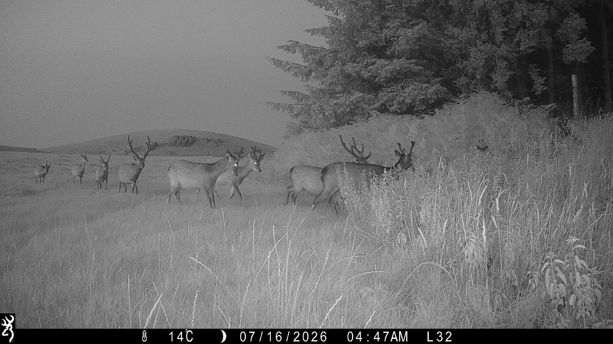
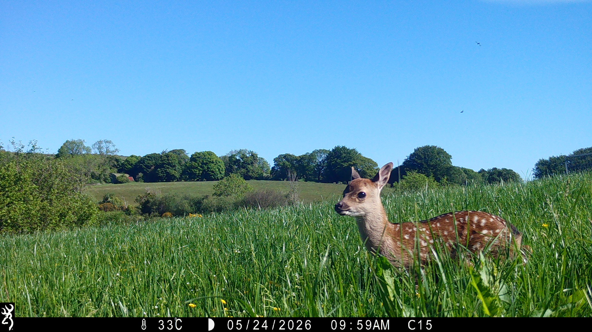

```{r setup, include=FALSE}

knitr::opts_knit$set(root.dir = "~/GitHub/Projects")

setwd("~/GitHub/Projects")
```

```{r, include = FALSE}

library(rmdformats)
library(knitr)

```

# About Me

I’m an ecology and environmental researcher with a background in wildlife conservation, horticulture and ecological fieldwork. My interests are understanding how wildlife interacts with habitats and how ecological data can be used to investigate environmental change.

I currently work as a Research Assistant on the DeerImpact project, investigating the ecological impacts of deer across Irish agricultural and forest landscapes. My work includes camera trap data analysis, ecological fieldwork, data management, R programming and spatial analysis.

My previous research includes an MSc project investigating how nutritional stress influences the resilience of solitary bees to insecticide exposure, combining experimental ecology with behavioural observations and statistical modelling.

I’m interested in wildlife habitat interactions, vegetation dynamics, biodiversity monitoring and applied ecological research.

# Projects
### Understanding Deer in the Irish Landscape

DeerImpact · Research Assistant · 2026 – Present


{style="display:block; margin:0 auto 5px auto; padding:8px; background:white;" fig-alt="Group of deer observed during fieldwork." width="800"}

<div style="text-align:center; font-size:0.8em; color:#666; margin-bottom:20px;">

*Group of bachlors observed during fieldwork. Photograph © Molly Kennedy & Yasmin Bonner.*

</div>

Deer are becoming an increasingly important issue for farmers in Ireland, with their presence in agricultural grasslands raising questions about the impact they may have on grass production. As part of the DeerImpact research project, I contributed to research investigating how deer activity may affect grasslands used for silage production, using field measurements and camera trap data to explore deer activity and its potential impact on grass availability.

<div style="float:right; width:401px; margin-left:25px; margin-bottom:0px;">

{fig-alt="Fawn observed during fieldwork in Wicklow." width="401"}

<div style="text-align:center; font-size:0.8em; color:#666; margin-top:5px;">

*Fawn observed during fieldwork in Wicklow. Photograph © Molly Kennedy & Yasmin Bonner.*

</div>

</div>

As part of the fieldwork, I have been measuring grass biomass both inside and outside protective cages. The cages prevent deer from accessing the grass, providing a comparison with nearby grass that is freely accessible to them. Grass samples are collected, weighed and dried in an oven to determine their dry matter weight. Comparing the biomass inside and outside the cages helps us understand differences in grass availability where deer have access, which is particularly relevant to grass being grown for silage production.

Alongside the vegetation measurements, I have been working with thousands of camera trap photographs collected across the study sites. Combining the camera trap data with the grass measurements allows us to look at deer activity alongside changes in grass biomass, helping to build a better understanding of the potential impact of deer on agricultural grass production.

Tools & methods: R · Camera trapping · Data management · Ecological analysis · Fieldwork


### The Impact of Nutritional Stress on Bee Resilience to Insecticide Exposure

MSc Research · UCD · Wildlife Conservation & Management

{style="display:block; margin:0 auto 5px auto; padding:8px; background:white;" fig-alt="Osmia." width="800"}

<div style="text-align:center; font-size:0.8em; color:#666; margin-bottom:20px;">

*Osmia bicornis foraging on phacelia tanacetifolia. Photograph © Yasmin Bonner.*

</div>

For my MSc research, I investigated whether nutritional stress affected the ability of the solitary bee Osmia bicornis to cope with insecticide exposure. I designed an experiment comparing bees exposed to insecticide, nutritional stress, both stresses together, and an unstressed control.

The project combined hands-on experimental ecology with data analysis. I managed over 400 flowering plants used within the experimental system, carried out behavioural observations and organised the resulting data for statistical analysis in R. I used Generalised Linear Mixed Models to investigate treatment effects and explore how different stressors interacted.

The project introduced me to a question that continues to interest me: ecological problems rarely happen in isolation. Understanding how different pressures interact can give us a much better picture of what wildlife is experiencing in the real world.

Tools & methods: R · GLMMs · Experimental ecology · Behavioural observation · BORIS

